# 📝 Article Summary Generator

An intelligent web application that transforms lengthy articles into concise, well-formatted summaries using Google's Gemini AI. Built with FastAPI for the backend and Streamlit for a clean, user-friendly frontend.


## ✨ Features

### Core Functionality

- **Intelligent Summarization**: Powered by Google's Gemini AI for high-quality text summarization
- **Multiple Summary Lengths**: Choose from short (2-3 sentences), medium (1-2 paragraphs), or long (2-3 paragraphs)
- **Real-time Processing**: Async processing with live progress indicators
- **Input Validation**: Comprehensive validation with helpful error messages

### User Experience

- **Clean, Responsive UI**: Built with Streamlit and custom CSS
- **Live Statistics**: Real-time character/word count and compression metrics
- **Summary History**: Track recent summaries within the session
- **Download Feature**: Export summaries as text files
- **Professional Styling**: Custom-designed interface with gradient headers and styled components

### Technical Features

- **Production-Ready Backend**: FastAPI with proper async/await patterns
- **Rate Limiting**: Prevent API abuse with configurable limits
- **Comprehensive Logging**: Structured logging with detailed request tracking
- **Error Handling**: Graceful error handling with user-friendly messages
- **Health Monitoring**: Service health checks and status reporting
- **LangSmith Integration**: Model performance tracking and monitoring

## 📸 Screenshots

### Application Interface


## 🏗️ Architecture

### System Architecture Diagram

```mermaid
graph TB
    User[👤 User] --> Frontend[🖥️ Streamlit Frontend<br/>Port: 8501]
    Frontend --> Backend[⚡ FastAPI Backend<br/>Port: 8000]

    Backend --> GeminiService[🤖 Gemini Service]
    Backend --> LangSmithService[📊 LangSmith Service]
    Backend --> RateLimit[🛡️ Rate Limiter]
    Backend --> Logger[📝 Structured Logger]

    GeminiService --> GeminiAPI[🌟 Google Gemini API]
    LangSmithService --> LangSmith[📈 LangSmith Platform]

    Backend --> ValidationLayer[✅ Pydantic Validation]
    Backend --> ErrorHandler[❌ Global Error Handler]

    subgraph "External Services"
        GeminiAPI
        LangSmith
    end

    subgraph "Backend Services"
        GeminiService
        LangSmithService
        RateLimit
        Logger
        ValidationLayer
        ErrorHandler
    end

    subgraph "User Interface"
        Frontend
    end

    subgraph "API Layer"
        Backend
    end
```



### Data Flow Architecture

```
┌─────────────────┐    HTTP Request     ┌─────────────────┐
│   Streamlit     │────────────────────▶│   FastAPI       │
│   Frontend      │                     │   Backend       │
│                 │◀────────────────────│                 │
│ • Text Input    │    JSON Response    │ • Rate Limiting │
│ • UI Controls   │                     │ • Validation    │
│ • Statistics    │                     │ • Error Handling│
│ • Download      │                     │ • Async Process │
└─────────────────┘                     └─────────────────┘
                                                  │
                                                  ▼
                                        ┌─────────────────┐
                                        │  Gemini Service │
                                        │                 │
                                        │ • Text Process  │
                                        │ • Retry Logic   │
                                        │ • Safety Config │
                                        │ • Async Calls   │
                                        └─────────────────┘
                                                  │
                                                  ▼
                                        ┌─────────────────┐
                                        │ Google Gemini   │
                                        │     API         │
                                        │                 │
                                        │ • AI Processing │
                                        │ • Summarization │
                                        │ • Content Safety│
                                        └─────────────────┘
                                                  │
                                                  ▼
                                        ┌─────────────────┐
                                        │ LangSmith       │
                                        │ Monitoring      │
                                        │                 │
                                        │ • Performance   │
                                        │ • Tracking      │
                                        │ • Analytics     │
                                        └─────────────────┘
```

### Component Interaction Flow

```
Request Flow:
1. User Input → Frontend Validation → API Request
2. FastAPI → Rate Limiting → Request Validation
3. Backend → Gemini Service → AI Processing
4. Response → LangSmith Tracking → User Display

Error Flow:
1. Error Occurs → Global Handler → Structured Logging
2. User-Friendly Message → Frontend Display
3. Error Context → LangSmith Logging
```

### Project Structure

```
article-summary-generator/
├── backend/                 # FastAPI backend
│   ├── main.py             # Main FastAPI application
│   ├── models.py           # Pydantic models and validation
│   └── __init__.py
├── frontend/               # Streamlit frontend
│   ├── app.py              # Main Streamlit application
│   └── __init__.py
├── services/               # Core services
│   ├── gemini_service.py   # Google Gemini AI integration
│   ├── langsmith_service.py # LangSmith monitoring
│   └── __init__.py
├── config.py               # Configuration management
├── requirements.txt        # Python dependencies
├── .env.example           # Environment variables template
├── docker-compose.yml     # Docker composition
└── Dockerfile             # Container configuration
```

## 🚀 Quick Start

### Prerequisites

- Python 3.8 or higher
- Google Cloud Project with Gemini API access
- (Optional) LangSmith account for monitoring

### Installation

1. **Clone the repository**

   ```bash
   git clone <repository-url>
   cd article-summary-generator
   ```

2. **Create virtual environment**

   ```bash
   python -m venv venv
   source venv/bin/activate  # On Windows: venv\Scripts\activate
   ```

3. **Install dependencies**

   ```bash
   pip install -r requirements.txt
   ```

4. **Set up environment variables**

   ```bash
   cp .env.example .env
   ```

   Edit `.env` file with your configuration:

   ```env
   # Required: Google Gemini API
   GEMINI_API_KEY=your-gemini-api-key

   # Optional: Google Cloud (if using service account)
   GOOGLE_CLOUD_PROJECT=your-project-id
   GOOGLE_APPLICATION_CREDENTIALS=path/to/service-account.json

   # Optional: LangSmith monitoring
   LANGCHAIN_TRACING_V2=true
   LANGCHAIN_API_KEY=your-langsmith-api-key
   LANGCHAIN_PROJECT=article-summary-generator
   ```

### Running the Application

#### Option 1: Using Python scripts (Recommended)

1. **Start the backend server**

   ```bash
   python run_backend.py
   ```

   The API will be available at `http://localhost:8000`

2. **Start the frontend (in a new terminal)**
   ```bash
   streamlit run frontend/app.py
   ```
   The web app will be available at `http://localhost:8501`

#### Option 2: Using Docker Compose

1. **Build and run with Docker**
   ```bash
   docker-compose up --build
   ```
   - Backend: `http://localhost:8000`
   - Frontend: `http://localhost:8501`

## 📋 Usage Guide

### Basic Usage

1. **Open the web application** at `http://localhost:8501`
2. **Paste your article** in the text area (minimum 50 characters, 10 words)
3. **Select summary length**: Short, Medium, or Long
4. **Click "Generate Summary"** and wait for processing
5. **View results** with detailed statistics and metrics
6. **Download** your summary as a text file if needed

### API Usage

The backend provides a REST API for programmatic access:

#### Generate Summary

```bash
curl -X POST "http://localhost:8000/summarize" \
  -H "Content-Type: application/json" \
  -d '{
    "text": "Your article text here...",
    "summary_length": "medium"
  }'
```

#### Health Check

```bash
curl "http://localhost:8000/health"
```

### Input Requirements

- **Minimum length**: 50 characters and 10 words
- **Maximum length**: 50,000 characters
- **Supported content**: Articles, blog posts, research papers, news articles
- **Languages**: Primarily English (Gemini supports multiple languages)

## ⚙️ Configuration

### Environment Variables

| Variable                         | Required | Default                     | Description                  |
| -------------------------------- | -------- | --------------------------- | ---------------------------- |
| `GEMINI_API_KEY`                 | Yes      | -                           | Google Gemini API key        |
| `GOOGLE_CLOUD_PROJECT`           | No       | -                           | GCP project ID               |
| `GOOGLE_APPLICATION_CREDENTIALS` | No       | -                           | Path to service account JSON |
| `LANGCHAIN_TRACING_V2`           | No       | `false`                     | Enable LangSmith tracking    |
| `LANGCHAIN_API_KEY`              | No       | -                           | LangSmith API key            |
| `LANGCHAIN_PROJECT`              | No       | `article-summary-generator` | LangSmith project name       |
| `API_HOST`                       | No       | `localhost`                 | Backend host                 |
| `API_PORT`                       | No       | `8000`                      | Backend port                 |
| `RATE_LIMIT_REQUESTS`            | No       | `100`                       | Requests per hour            |
| `DEBUG`                          | No       | `true`                      | Enable debug mode            |
| `LOG_LEVEL`                      | No       | `INFO`                      | Logging level                |

### Google Cloud Setup

1. **Create a Google Cloud Project**
2. **Enable the Generative AI API**
3. **Create an API key** or service account
4. **Set environment variables** as described above

For detailed setup instructions, visit the [Google AI Studio](https://makersuite.google.com/).

### LangSmith Setup (Optional)

1. **Create account** at [LangSmith](https://smith.langchain.com/)
2. **Get API key** from your dashboard
3. **Set environment variables** for tracking
4. **Monitor performance** through the LangSmith dashboard

## 🔧 Development

### Code Structure

- **Backend (`backend/`)**:

  - `main.py`: FastAPI application with routes and middleware
  - `models.py`: Pydantic models for request/response validation

- **Services (`services/`)**:

  - `gemini_service.py`: Google Gemini AI integration with retry logic
  - `langsmith_service.py`: LangSmith monitoring and tracking

- **Frontend (`frontend/`)**:

  - `app.py`: Streamlit application with async support

- **Configuration**:
  - `config.py`: Centralized configuration management
  - `.env`: Environment variables (not committed)

### Key Features Implementation

#### Rate Limiting

```python
from slowapi import Limiter
limiter = Limiter(key_func=get_remote_address)

@app.post("/summarize")
@limiter.limit("100/hour")
async def summarize_article(request: Request, ...):
    # Processing logic
```

#### Error Handling

```python
@app.exception_handler(Exception)
async def global_exception_handler(request: Request, exc: Exception):
    logger.error("Unhandled exception", error=str(exc))
    return JSONResponse(status_code=500, content=...)
```

#### Async Processing

```python
async def summarize_text(text: str, summary_length: str):
    loop = asyncio.get_event_loop()
    response = await loop.run_in_executor(None, self._generate_with_retry, prompt)
    return response
```

### Running Tests

```bash
# Install test dependencies
pip install pytest pytest-asyncio

# Run tests
pytest tests/
```

### Code Quality

```bash
# Format code
black .

# Sort imports
isort .

# Lint code
flake8 .
```

## 🐳 Docker Deployment

### Building the Image

```bash
docker build -t article-summary-generator .
```

### Running with Docker Compose

```bash
# Development
docker-compose up

# Production
docker-compose -f docker-compose.yml -f docker-compose.prod.yml up
```

### Environment Configuration for Docker

Create a `.env` file with your production settings:

```env
# Production settings
DEBUG=false
LOG_LEVEL=WARNING
API_HOST=0.0.0.0
RATE_LIMIT_REQUESTS=1000

# Your API keys
GEMINI_API_KEY=your-production-api-key
LANGCHAIN_API_KEY=your-langsmith-key
```

## 📊 Monitoring and Analytics

### LangSmith Integration

The application includes comprehensive monitoring through LangSmith:

- **Request Tracking**: All summarization requests are tracked
- **Performance Metrics**: Processing time, compression ratios, model performance
- **Error Logging**: Detailed error tracking and analysis
- **Custom Metadata**: Input/output lengths, model configurations

### Logging

Structured logging with configurable levels:

```python
import structlog
logger = structlog.get_logger()

logger.info("Request processed",
           processing_time=1.23,
           compression_ratio=0.3)
```

### Health Monitoring

- **Health Endpoint**: `/health` provides service status
- **Service Checks**: Validates Gemini API configuration
- **Docker Health Checks**: Container health monitoring

## 🔒 Security Considerations

### API Security

- **Rate Limiting**: Prevents abuse and excessive usage
- **Input Validation**: Comprehensive text validation and sanitization
- **Error Handling**: Prevents information leakage through error messages
- **CORS Configuration**: Restricted to necessary origins

### Environment Security

- **Environment Variables**: Sensitive data stored in environment variables
- **Docker Secrets**: Support for Docker secrets in production
- **Non-root User**: Docker containers run as non-root user

### API Keys

- **Secure Storage**: Never commit API keys to version control
- **Environment Isolation**: Separate keys for development/production
- **Key Rotation**: Regular API key rotation recommended

## 🚦 Troubleshooting

### Common Issues

#### "Unable to connect to the summarization service"

- Ensure the backend is running on port 8000
- Check if the `GEMINI_API_KEY` is set correctly
- Verify firewall settings

#### "API Error: Validation error"

- Check input text length (minimum 50 characters, 10 words)
- Ensure text contains meaningful content
- Try with different text

#### "Gemini API call failed"

- Verify API key is valid and has sufficient quota
- Check Google Cloud project settings
- Ensure Generative AI API is enabled

#### Rate Limiting Errors

- Reduce request frequency
- Check rate limit settings in configuration
- Consider upgrading API quotas

### Debug Mode

Enable debug mode for detailed logging:

```bash
export DEBUG=true
export LOG_LEVEL=DEBUG
python run_backend.py
```

### Logs Location

- **Development**: Console output
- **Docker**: `/app/logs/` directory
- **Production**: Configure external log aggregation

## 🤝 Contributing

1. Fork the repository
2. Create a feature branch (`git checkout -b feature/amazing-feature`)
3. Commit your changes (`git commit -m 'Add amazing feature'`)
4. Push to the branch (`git push origin feature/amazing-feature`)
5. Open a Pull Request

### Development Guidelines

- Follow PEP 8 style guidelines
- Add tests for new features
- Update documentation for API changes
- Use type hints throughout the codebase
- Maintain backward compatibility

## 🙏 Acknowledgments

- **Google Gemini AI**: For providing the powerful summarization capabilities
- **FastAPI**: For the excellent async web framework
- **Streamlit**: For the intuitive frontend framework
- **LangSmith**: For comprehensive model monitoring
- **Contributors**: Thanks to all contributors who help improve this project

## 📞 Support

- **Issues**: Report bugs and request features via [GitHub Issues](../../issues)
- **Discussions**: Join the conversation in [GitHub Discussions](../../discussions)
- **Documentation**: Check the [Wiki](../../wiki) for additional guides

---

**Happy Summarizing!** 🚀✨
